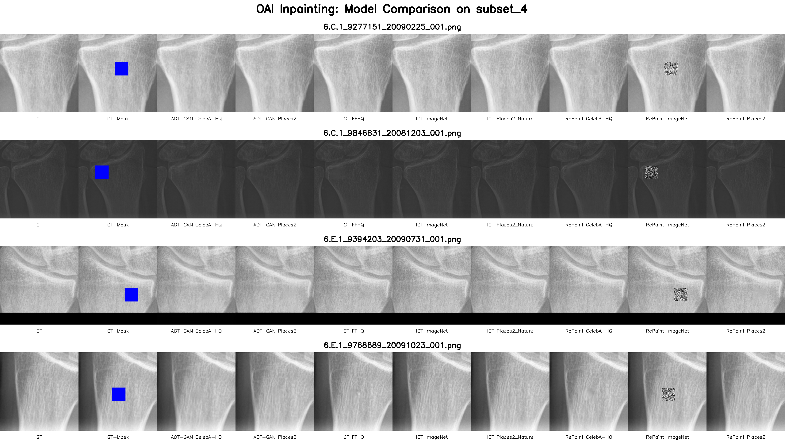

# OAI X-ray Inpainting Project

Comprehensive implementation and comparison of state-of-the-art deep learning inpainting methods for wrist X-ray image analysis on the Osteoarthritis Initiative (OAI) dataset.

### 📓 Google Colab Notebooks

**🚀 Streamlined (Recommended)** - 7 cells, one-click actions
[](https://colab.research.google.com/github/johnreynolds3d/OAI-inpainting/blob/master/notebooks/OAI_Inpainting_Streamlined.ipynb)

**📚 Full Version** - 30+ cells, detailed control
[](https://colab.research.google.com/github/johnreynolds3d/OAI-inpainting/blob/master/notebooks/OAI_Inpainting_Colab.ipynb)

---

## 📑 Table of Contents

- [Overview](#-overview)
- [Quick Start](#-quick-start)
  - [Google Colab (Recommended)](#option-1-google-colab-recommended)
  - [Local Installation](#option-2-local-installation)
- [Comprehensive Testing](#-comprehensive-testing)
- [Training Models](#-training-models)
- [Testing & Evaluation](#-testing--evaluation)
- [Data Management](#-data-management)
- [Configuration](#-configuration)
- [Results](#-results)
- [Development](#-development)
- [Troubleshooting](#-troubleshooting)
- [Contributing](#-contributing)
- [License](#-license)

---

## 🎯 Overview

This project implements and compares **three state-of-the-art inpainting methods** for medical X-ray analysis:

- **AOT-GAN** - Attention-based Outpainting Transformer GAN
- **ICT** - Image Completion Transformer
- **RePaint** - Repaint-based diffusion model for inpainting

### 🎨 Visual Results

Side-by-side comparison of all model variants on OAI wrist X-rays:



*From left to right: Ground Truth | Masked Input | 8 Model Variants (AOT-GAN: CelebA-HQ, Places2 | ICT: FFHQ, ImageNet, Places2_Nature | RePaint: CelebA-HQ, ImageNet, Places2)*

**Key Findings:**
- 🏆 **AOT-GAN CelebA-HQ**: Best overall performance (19.92 dB PSNR)
- 📊 **Quantitative metrics**: PSNR, SSIM, MAE calculated for all variants
- 🔬 **Balanced dataset**: 539 images split 80/10/10 (train/val/test) with equal low/high BMD distribution

### Model Variants Available

Each architecture has been pretrained on multiple datasets, giving you **9 total model variants** to test:

| Model | Variants | Use Case |
|-------|----------|----------|
| **AOT-GAN** | CelebA-HQ, Places2, OAI | Fast GAN-based inpainting |
| **ICT** | FFHQ, ImageNet, Places2_Nature, OAI | Transformer-based completion |
| **RePaint** | CelebA-HQ, ImageNet, Places2 | Diffusion-based high-quality |

### Key Features

✅ **Git-tracked scripts** - Pull latest updates automatically in Colab
✅ **Comprehensive testing** - Test all 9 models with one command
✅ **Platform-agnostic** - Works on Linux, macOS, Windows, and Colab
✅ **Production-ready** - Pre-commit hooks, linting, type checking
✅ **Well-documented** - Extensive guides and examples

---

## 🚀 Quick Start

### Option 1: Google Colab (Recommended)

**Best for:** Quick testing, no local GPU required, cloud-based training

Choose your workflow:
- **Streamlined Notebook** (7 cells) - Simple, efficient, recommended for most users
- **Full Notebook** (30+ cells) - Detailed control, all options exposed

**Colab Link:** https://colab.research.google.com/github/johnreynolds3d/OAI-inpainting/blob/master/notebooks/OAI_Inpainting_Colab.ipynb

#### Setup Steps:

**1. Upload Data to Google Drive**

Upload the `OAI_untracked/` directory to:
```
/content/drive/MyDrive/Colab Notebooks/OAI_untracked/
```

Expected structure:
```
OAI_untracked/
├── data/
│   ├── oai/
│   │   └── img/          # 539 PNG X-ray images (~11.6 MB)
│   └── pretrained/       # Model checkpoint files (~16GB)
│       ├── aot-gan/
│       ├── ict/
│       └── repaint/
└── README.md
```

**Upload requirements:**
- Total size: ~16GB
- Upload time: 30-60 minutes (depending on connection)
- Required: OAI images (~11.6 MB)
- Optional but recommended: Pretrained models (~16GB)

**⚠️ CRITICAL: Directory Structure**

Both directories **MUST be siblings** in `Colab Notebooks/`:
```
/content/drive/MyDrive/Colab Notebooks/
├── OAI-inpainting/      # ← Cloned from GitHub (automatic)
└── OAI_untracked/       # ← Your uploaded data
    ├── data/            # ← OAI images & pretrained models
    └── results/         # ← Will be created for outputs
```

This sibling structure enables **relative symlinks** that work identically on local & Colab:
- `data -> ../OAI_untracked/data/`
- `results -> ../OAI_untracked/results/`

**2. Run the Colab Notebook**

Click the "Open in Colab" badge above. The notebook will automatically:
- ✅ Clone to `Colab Notebooks/OAI-inpainting/` (sibling to your data)
- ✅ Mount Google Drive
- ✅ Create relative symlinks (platform-agnostic!)
- ✅ Generate train/valid/test splits
- ✅ Create masks and edge maps

**3. Test All Models (Recommended - 30-60 minutes)**

Run Cell 11 in the notebook:
```python
tester = ModelTester(timeout_per_model=600)
results = tester.run_comprehensive_test(models=["all"])
```

Tests all 9 model variants with **results saved to Google Drive**!

**4. Or Train New Models (Optional - 6-8 hours)**

Run Cell 14+ for full training pipeline. **All outputs persist in Google Drive!**

### Option 2: Local Installation

**Best for:** Development, custom experiments, full control

**Works anywhere!** You can clone to any directory as long as `OAI_untracked/` is a sibling.

```bash
# 1. Navigate to your preferred parent directory (can be anywhere!)
cd /your/preferred/location/

# 2. Clone repository
git clone https://github.com/johnreynolds3d/OAI-inpainting.git
cd OAI-inpainting

# 2. Create virtual environment
python -m venv venv
source venv/bin/activate  # Linux/macOS
# venv\Scripts\activate   # Windows

# 3. Install dependencies
pip install -e ".[dev,ml]"

# 4. Install pre-commit hooks (for development)
pre-commit install

# 5. Setup data and results with symlinks (OPTION A: Recommended)
# Use RELATIVE symlinks for platform-agnostic paths
# Both directories must be siblings (same parent directory)
ln -s ../OAI_untracked/data/ data
ln -s ../OAI_untracked/results/ results
# Verify: ls data/oai/img/*.png | wc -l  # Should show 539

# 5. Setup data (OPTION B: Copy files)
python scripts/setup_data.py
# Or specify custom location:
# python scripts/setup_data.py --source-dir /path/to/OAI_untracked
# Note: results/ directory will still be created locally

# 6. Generate dataset splits
cd data/oai
python split.py
cd ../..
```

**Note on Data & Results Setup:**
- **Option A (Symlink - Recommended)**:
  - ✅ **Universal**: Works in ANY directory location
  - ✅ **Portable**: Move both directories together, symlinks still work
  - ✅ **Space-efficient**: Saves ~16GB (no data duplication)
  - ✅ **Single source**: One data location, multiple project clones possible
  - ✅ **Persistent results**: Survives Git operations (checkout, clean, reset)
  - ✅ **Colab-compatible**: Same structure on local and Google Drive
  - ⚠️  Requires: Both directories must be siblings (same parent directory)
  - ⚠️  Platform: Linux/macOS native, Windows needs admin for symlinks
- **Option B (Copy)**:
  - Works on all platforms including Windows
  - Uses more disk space (~16GB duplicated)
  - Results stored locally in project directory
  - Data tied to one project clone

---

## 🧪 Comprehensive Testing

**The fastest way to test all model variants on your OAI data.**

### Command Line

```bash
# Test all 9 model variants (recommended)
python scripts/colab_comprehensive_test.py --models all

# Test specific model families
python scripts/colab_comprehensive_test.py --models aot-gan
python scripts/colab_comprehensive_test.py --models ict repaint

# Adjust timeout (default: 600 seconds per model)
python scripts/colab_comprehensive_test.py --timeout 900
```

### Python API

```python
from scripts.colab_comprehensive_test import ModelTester

# Test all models
tester = ModelTester(timeout_per_model=600, verbose=True)
results = tester.run_comprehensive_test(models=["all"])

# Check results
print(f"✅ Successful: {results['summary']['successful']}")
print(f"❌ Failed: {results['summary']['failed']}")
print(f"⏭️ Skipped: {results['summary']['skipped']}")

# Access detailed results
for result in results['results']:
    if result['success']:
        print(f"{result['model']}: {result['elapsed']:.1f}s")
```

### What Gets Tested

| Model Family | Variants | Test Images | Expected Time |
|--------------|----------|-------------|---------------|
| **AOT-GAN** | CelebA-HQ, Places2, OAI | 4 X-rays | ~6-9 min |
| **ICT** | FFHQ, ImageNet, Places2_Nature, OAI | 4 X-rays | ~12-16 min |
| **RePaint** | CelebA-HQ, ImageNet, Places2 | 4 X-rays | ~18-24 min |
| **Total** | 9 variants | 4 X-rays | **~30-60 min** |

*Test set: 4 OAI X-ray images from subset_4 (2 low BMD, 2 high BMD - perfectly balanced)*

### Output

Results are organized by model variant:

```
results/
├── comprehensive_test_results.json  # Summary with metrics
├── AOT-GAN/
│   ├── CelebA-HQ/subset_4/         # Inpainted images
│   ├── Places2/subset_4/
│   └── OAI/subset_4/
├── ICT/
│   ├── FFHQ/subset_4/
│   ├── ImageNet/subset_4/
│   ├── Places2_Nature/subset_4/
│   └── OAI/subset_4/
└── RePaint/
    ├── CelebA-HQ/subset_4/
    ├── ImageNet/subset_4/
    └── Places2/subset_4/
```

**JSON results file contains:**
- Timestamp and duration
- Success/failure status for each model
- Execution time per model
- Output directory paths
- Error messages (if any)

---

## 🎓 Training Models

### Train Individual Models

```bash
# Train AOT-GAN on OAI data
python scripts/train.py --model aot-gan --config configs/oai_config.yml

# Train ICT on OAI data
python scripts/train.py --model ict --config configs/oai_config.yml

# Note: RePaint is inference-only (pretrained diffusion model)
```

### Training Pipeline (Google Colab)

For full training pipeline in Colab:

```python
from scripts.colab_pipeline import run_full_pipeline, run_phase

# Run complete pipeline (6-8 hours)
run_full_pipeline(timeout_hours=8)

# Or run individual phases:
run_phase(1)  # Quick verification (5 min)
run_phase(2)  # AOT-GAN training (2-4 hours)
run_phase(3)  # ICT training (1-3 hours)
run_phase(4)  # RePaint inference (30 min)
run_phase(5)  # Evaluation (15 min)
```

### Training Configuration

Customize training via YAML configs:

```yaml
# configs/oai_config.yml (AOT-GAN example)
data:
  train_images: "./data/oai/train/img"
  train_masks: "./data/oai/train/mask"

model:
  name: "aotgan"
  block_num: 8
  rates: "1+2+4+8"
  gan_type: "smgan"

training:
  batch_size: 8
  image_size: 512
  lr_g: 1e-4
  lr_d: 1e-4
  max_epochs: 100
```

See [Configuration](#-configuration) section for more details.

---

## 🧪 Testing & Evaluation

### Individual Model Testing

```bash
# Test AOT-GAN
python scripts/test.py --model aot-gan --config configs/oai_config.yml

# Test ICT
python scripts/test.py --model ict --config configs/oai_config.yml

# Test RePaint
python scripts/test.py --model repaint --config configs/oai_config.yml
```

### Evaluation & Metrics

```bash
# Evaluate all models on subset_4
python scripts/evaluate.py --models aot-gan ict repaint --subset subset_4

# Evaluate on full test set
python scripts/evaluate.py --models all --subset test

# Custom output directory
python scripts/evaluate.py --models aot-gan --output results/custom_eval/
```

**Metrics calculated:**
- **Inpainting Quality**: PSNR, SSIM, L1 distance
- **Classification**: Accuracy, Precision, Recall, F1-score
- **Statistical**: Paired t-tests, confidence intervals
- **Visual**: Side-by-side comparisons, difference maps

---

## 📊 Data Management

### Dataset Structure

```
data/
├── oai/
│   ├── img/              # Original 539 OAI X-ray images
│   ├── train/
│   │   ├── img/          # Training images
│   │   ├── mask/         # Random square masks
│   │   ├── mask_inv/     # Inverted masks (for RePaint)
│   │   └── edge/         # Canny edge maps (for ICT)
│   ├── valid/            # Validation split
│   │   ├── img/
│   │   ├── mask/
│   │   ├── mask_inv/
│   │   └── edge/
│   └── test/             # Test split
│       ├── img/
│       ├── mask/
│       ├── mask_inv/
│       ├── edge/
│       └── subset_4/     # 4-image evaluation subset
│           ├── img/
│           ├── mask/
│           ├── mask_inv/
│           ├── edge/
│           └── subset_4_info.csv
└── pretrained/
    ├── aot-gan/
    │   ├── celebahq/     # CelebA-HQ pretrained
    │   ├── places2/      # Places2 pretrained
    │   └── OAI/          # OAI-trained (if available)
    ├── ict/
    │   ├── Transformer/
    │   └── Upsample/
    │       ├── FFHQ/
    │       ├── ImageNet/
    │       ├── Places2_Nature/
    │       └── OAI/      # OAI-trained (if available)
    └── repaint/
        ├── 256x256_classifier.pt
        ├── 256x256_diffusion.pt
        ├── celeba256_250000.pt
        └── places256_300000.pt
```

### Data Setup Script

```bash
# Auto-detect and setup data (searches common locations)
python scripts/setup_data.py

# Preview what would be copied (dry run)
python scripts/setup_data.py --dry-run

# Specify custom source directory
python scripts/setup_data.py --source-dir /path/to/OAI_untracked

# Force overwrite existing files
python scripts/setup_data.py --force
```

**What the script does:**
- ✅ Auto-detects OAI_untracked directory in common locations
- ✅ Validates data structure and file counts
- ✅ Estimates disk space requirements
- ✅ Copies data with progress tracking
- ✅ Handles missing optional components gracefully
- ✅ Provides detailed error messages

### Generating Dataset Splits

After data setup, generate splits and auxiliary data:

```bash
cd data/oai
python split.py
```

**This creates:**
- ✅ **Perfectly balanced train/valid/test splits** (80%/10%/10%)
  - Uses **ALL 539 images** with mutually exclusive splits
  - Each split maintains **exact 50/50 balance** of low BMD vs high BMD
  - Stratified by BMD threshold (median BMD = classification boundary)
- ✅ **Random square masks** for inpainting tasks
- ✅ **Canny edge maps** for ICT model's edge-aware inpainting
- ✅ **subset_4 evaluation set**: 2 low BMD + 2 high BMD images for quick testing

**Split details:**
- **Training**: 80% (431 images: ~216 low BMD, ~215 high BMD)
- **Validation**: 10% (54 images: ~27 low BMD, ~27 high BMD)
- **Testing**: 10% (54 images: ~27 low BMD, ~27 high BMD)
- **Total**: 539 images (100% of available data)
- **Balance**: Every split maintains equal low/high BMD representation
- **Exclusivity**: No image appears in multiple splits

---

## ⚙️ Configuration

All models use platform-agnostic YAML configuration files in the `configs/` directory.

### Configuration Files

```
configs/
├── oai_config.yml        # Main config for OAI dataset
└── subset_4_config.yml   # Config for subset_4 evaluation
```

### AOT-GAN Configuration

```yaml
# Example: configs/oai_config.yml
data:
  train_images: "./data/oai/train/img"
  train_masks: "./data/oai/train/mask"
  test_images: "./data/oai/test/img/subset_4"
  test_masks: "./data/oai/test/mask/subset_4"

model:
  name: "aotgan"
  block_num: 8
  rates: "1+2+4+8"
  gan_type: "smgan"

training:
  batch_size: 8
  image_size: 512
  lr_g: 1e-4
  lr_d: 1e-4
  max_epochs: 100
  num_workers: 4

hardware:
  distributed: false
  tensorboard: true

paths:
  save_dir: "./results/logs/aot-gan"
  outputs: "./results/AOT-GAN/OAI"
  resume: null  # or path to checkpoint
```

### ICT Configuration

```yaml
# Example: configs/oai_config.yml
MODE: 2          # 1=train, 2=test, 3=eval
MODEL: 2
MASK: 3
EDGE: 1
GPU: [0]
SEED: 10

# Dataset paths
TRAIN_FLIST: "./data/oai/train/img"
VAL_FLIST: "./data/oai/valid/img"
TEST_FLIST: "./data/oai/test/img"

TRAIN_EDGE_FLIST: "./data/oai/train/edge"
VAL_EDGE_FLIST: "./data/oai/valid/edge"
TEST_EDGE_FLIST: "./data/oai/test/edge"

TRAIN_MASK_FLIST: "./data/oai/train/mask"
VAL_MASK_FLIST: "./data/oai/valid/mask"
TEST_MASK_FLIST: "./data/oai/test/mask"

# Training parameters
LR: 0.0001
BATCH_SIZE: 32
INPUT_SIZE: 256
MAX_ITERS: 5e6

# Paths
PATH: "./results/logs/ict"
RESULTS: "./results/ICT/OAI"
```

### RePaint Configuration

RePaint uses specialized configs generated per test run. See `scripts/colab_comprehensive_test.py` for examples.

---

## 📈 Results

### Results Directory Structure

```
results/
├── comprehensive_test_results.json  # Summary from comprehensive testing
├── AOT-GAN/
│   ├── CelebA-HQ/
│   │   └── subset_4/               # Inpainted images
│   ├── Places2/
│   │   └── subset_4/
│   └── OAI/
│       └── subset_4/
├── ICT/
│   ├── FFHQ/subset_4/
│   ├── ImageNet/subset_4/
│   ├── Places2_Nature/subset_4/
│   └── OAI/subset_4/
├── RePaint/
│   ├── CelebA-HQ/subset_4/
│   ├── ImageNet/subset_4/
│   └── Places2/subset_4/
├── metrics/                        # Quantitative metrics
│   ├── psnr_ssim_results.csv
│   ├── classification_results.csv
│   └── statistical_tests.json
├── plots/                          # Visualizations
│   ├── model_comparison.png
│   ├── training_curves.png
│   └── quality_metrics.png
└── logs/                           # Training/inference logs
    ├── aot-gan/
    ├── ict/
    └── repaint/
```

### Analyzing Results

```python
import json
from pathlib import Path

# Load comprehensive test results
results_file = Path("results/comprehensive_test_results.json")
with results_file.open() as f:
    results = json.load(f)

# Print summary
print(f"Total tests: {results['summary']['total']}")
print(f"Successful: {results['summary']['successful']}")
print(f"Duration: {results['duration']}")

# Analyze individual models
for result in results['results']:
    if result['success']:
        print(f"{result['model']}: {result['elapsed']:.1f}s")
        print(f"  Output: {result['output_dir']}")
```

### Evaluation Metrics

**Inpainting Quality Metrics:**
- **PSNR** (Peak Signal-to-Noise Ratio): Higher is better (typically 20-40 dB)
- **SSIM** (Structural Similarity Index): Higher is better (0-1 scale)
- **L1 Loss**: Lower is better (pixel-wise difference)

**Classification Metrics:**
- **Accuracy**: Overall correctness
- **Precision/Recall**: Class-specific performance
- **F1-Score**: Harmonic mean of precision/recall
- **Confusion Matrix**: Detailed class predictions

---

## 🛠️ Development

### Code Quality Tools

This project uses modern Python development tools:

- **Ruff**: Fast linter and formatter (replaces Black + flake8 + isort)
- **MyPy**: Static type checking
- **Pre-commit**: Automated code quality checks
- **Pytest**: Testing framework with coverage

### Development Commands

```bash
# Format code
ruff format .

# Lint code
ruff check .

# Fix linting issues automatically
ruff check . --fix

# Run type checking
mypy src/ scripts/

# Run tests
pytest tests/

# Run tests with coverage
pytest tests/ --cov=src --cov-report=html
```

### Pre-commit Hooks

The project includes pre-commit hooks that automatically:
- ✅ Format code with Ruff
- ✅ Check for linting issues
- ✅ Validate YAML/JSON files
- ✅ Check for large files
- ✅ Ensure proper line endings
- ✅ Check for merge conflicts

Install hooks:
```bash
pre-commit install
```

### Project Structure

```
OAI-inpainting/
├── configs/                    # Configuration files
│   ├── oai_config.yml
│   └── subset_4_config.yml
├── scripts/                    # Main scripts
│   ├── train.py               # Training script
│   ├── test.py                # Testing script
│   ├── evaluate.py            # Evaluation script
│   ├── setup_data.py          # Data setup
│   ├── colab_pipeline.py      # Colab training pipeline
│   └── colab_comprehensive_test.py  # Comprehensive testing
├── src/                       # Core source code
│   ├── __init__.py
│   ├── paths.py              # Path utilities
│   ├── config.py             # Config management
│   ├── data.py               # Data loaders
│   ├── experiment_tracking.py
│   └── data_versioning.py
├── models/                    # Model implementations
│   ├── aot-gan/              # AOT-GAN implementation
│   ├── ict/                  # ICT implementation
│   ├── repaint/              # RePaint implementation
│   └── classifier/           # Classification utilities
├── data/                      # Data (not tracked)
│   ├── oai/                  # OAI dataset
│   └── pretrained/           # Pretrained models
├── results/                   # Results (not tracked)
├── tests/                     # Test suite
│   ├── unit/
│   └── integration/
├── notebooks/                 # Jupyter notebooks
│   └── OAI_Inpainting_Colab.ipynb
├── docs/                      # Documentation
├── pyproject.toml            # Project metadata
├── requirements-dev.txt      # Dev dependencies
└── README.md                 # This file
```

---

## 📤 Sharing Data with Collaborators

### For Data Owners: How to Share

**Goal:** Share your OAI data with collaborators while keeping results private.

**1. Share Data Folder (Read-Only)**

In Google Drive:
1. Navigate to: `/MyDrive/Colab Notebooks/OAI_untracked/data/`
2. Right-click on `data` folder → Share → Share
3. Set: **"Anyone with the link"** + **"Viewer"** (read-only)
4. Copy and share the link

**Important:** Only share `data/` folder, NOT `results/`!

**2. Share Instructions**

Provide users with:
```
📥 OAI Inpainting Shared Data

Sharing Link: [your-link-here]

Setup:
1. Click link → "Add shortcut to Drive"
2. See README.md "Using Shared Data" section
3. Run Colab notebook
4. Results save to YOUR OWN directory

Data is read-only - your results stay private!
```

### For Data Consumers: Using Shared Data

**If using someone's shared read-only data:**

**Option A: Manual Copy in Colab**

```python
# In a Colab cell after mounting Drive and cloning repo:
from pathlib import Path
import shutil

# Copy shared data (update path to your shortcut location)
shared_path = Path("/content/drive/MyDrive/[shortcut-name]/data")
shutil.copytree(shared_path, "data", dirs_exist_ok=True)

# Create YOUR OWN results directory
Path("../OAI_untracked/results").mkdir(parents=True, exist_ok=True)
Path("results").symlink_to("../OAI_untracked/results/")

print("✅ Data copied from shared source")
print("✅ Results will save to YOUR directory")
```

**Option B: Get Your Own Copy**

Ask the data owner to share the data, then:
1. Download the shared data to your local machine
2. Upload to your own Google Drive: `Colab Notebooks/OAI_untracked/data/`
3. Follow the normal setup (Cell 3 creates symlinks automatically)

**Your directory structure with shared data:**
```
/content/drive/MyDrive/
├── [Shared Data Shortcut]/  ← Read-only access to owner's data
│   └── data/
├── Colab Notebooks/
│   ├── OAI-inpainting/
│   │   ├── data/            ← Local copy from shared (temporary)
│   │   └── results/         → ../OAI_untracked/results/ (yours!)
│   └── OAI_untracked/
│       └── results/         ← YOUR outputs (isolated from owner)
```

**Benefits:**
- ✅ No need to store 16GB in your Drive
- ✅ Your results completely separate from owner's
- ✅ Quick access to latest shared data
- ✅ Original data protected (read-only)

**Trade-offs:**
- ⚠️ Data copied to local Colab (lost on disconnect - just re-copy)
- ⚠️ Manual setup needed (not automatic like own data)

### Security & Privacy

**For Data Owners:**
- ✅ Safe to share: `data/` folder (images, models)
- ❌ Don't share: `results/` folder (experiments, outputs)
- ✅ Read-only prevents modifications to your data

**For Data Consumers:**
- ✅ Your results: Saved to YOUR Drive space
- ✅ Your privacy: No access to owner's results
- ✅ Your experiments: Remain private

---

## 🔧 Troubleshooting

### Google Colab Issues

#### "OAI data not found in Google Drive"
**Solution:**
- Verify data is at: `/content/drive/MyDrive/Colab Notebooks/OAI_untracked/`
- Check Google Drive is mounted: Run the Drive mount cell
- Ensure directory structure matches expected format

#### "Upload failed or incomplete"
**Solution:**
- Large files (>1GB) may timeout - upload in batches
- Check Google Drive storage space (need 16GB+)
- Verify stable internet connection
- Try uploading via Google Drive web interface instead

#### "Can't access files" or "Permission denied"
**Solution:**
- Ensure files are in "My Drive", not "Shared with me"
- Check file sharing permissions in Google Drive
- Try copying files to a new folder in My Drive

#### "subset_4 data not found"
**Solution:**
- Run the data split generation: `cd data/oai && python split.py`
- Check that split.py ran successfully without errors
- Verify 4 images exist in each subset_4 subdirectory

### Local Installation Issues

#### "Could not find untracked data directory"
**Solution:**
```bash
# Specify exact path
python scripts/setup_data.py --source-dir /path/to/OAI_untracked

# Or check common locations
ls ~/Documents/OAI_untracked
ls ~/Downloads/OAI_untracked
```

#### "Insufficient disk space"
**Solution:**
```bash
# Check available space
df -h

# Clean up unnecessary files
# Pretrained models are optional - you can skip them
python scripts/setup_data.py --source-dir /path/to/OAI_untracked
```

#### "Permission denied"
**Solution:**
```bash
# Fix permissions
chmod -R 755 .

# Or use sudo (not recommended)
sudo python scripts/setup_data.py
```

### General Issues

#### "Image count mismatch"
**Expected:** 539 PNG files in `data/oai/img/`

**Check:**
```bash
ls data/oai/img/*.png | wc -l  # Should show 539
```

**File naming convention:**
- `6.C.1_*.png` - OAI project code 6, visit C.1 (could be low or high BMD)
- `6.E.1_*.png` - OAI project code 6, visit E.1 (could be low or high BMD)
- BMD classification (low vs high) is determined by median threshold, not filename
- See `data.csv` for actual BMD values and classifications

#### "Model files missing"
**Solution:**
- Pretrained models are optional
- Download from source if needed
- Missing models will show as "skipped" in comprehensive test
- Training will use random initialization without pretrained weights

#### "Out of memory errors"
**Solution:**
```bash
# Reduce batch size in config
# configs/oai_config.yml
training:
  batch_size: 4  # Reduced from 8

# Or use smaller image size
training:
  image_size: 256  # Reduced from 512
```

#### "Import errors"
**Solution:**
```bash
# Ensure virtual environment is activated
source venv/bin/activate  # Linux/macOS
venv\Scripts\activate     # Windows

# Reinstall dependencies
pip install -e ".[dev,ml]"

# Check Python path
python -c "import sys; print('\n'.join(sys.path))"
```

#### "CUDA/GPU not available"
**Solution:**
```bash
# Check PyTorch CUDA
python -c "import torch; print(f'CUDA available: {torch.cuda.is_available()}')"

# In Colab: Enable GPU
# Runtime → Change runtime type → GPU

# Reinstall PyTorch with CUDA support
pip install torch torchvision --index-url https://download.pytorch.org/whl/cu118
```

### Getting Help

If you're still experiencing issues:

1. **Check existing issues**: [GitHub Issues](https://github.com/johnreynolds3d/OAI-inpainting/issues)
2. **Review error logs**: Check `results/logs/` for detailed error messages
3. **Create new issue**: Include:
   - Error message (full traceback)
   - Steps to reproduce
   - Environment details (OS, Python version, GPU)
   - Configuration files used

---

## 🤝 Contributing

We welcome contributions! See [docs/contributing.md](docs/contributing.md) for detailed guidelines.

### Quick Contributing Guide

1. Fork the repository
2. Create a feature branch: `git checkout -b feature/amazing-feature`
3. Make your changes
4. Run tests: `pytest tests/`
5. Run linting: `ruff check . --fix`
6. Commit changes: `git commit -m 'Add amazing feature'`
7. Push to branch: `git push origin feature/amazing-feature`
8. Open a Pull Request

### Development Setup

```bash
# Clone your fork
git clone https://github.com/YOUR_USERNAME/OAI-inpainting.git
cd OAI-inpainting

# Install dev dependencies
pip install -e ".[dev,ml]"

# Install pre-commit hooks
pre-commit install

# Run tests
pytest tests/
```

---

## 📄 License

This project is licensed under the MIT License - see the [LICENSE](LICENSE) file for details.

### Third-Party Licenses

This project includes third-party models and code with their own licenses:

- **AOT-GAN**: Apache 2.0 License
- **RePaint**: MIT License + CC BY-NC-SA 4.0 (Huawei)
- **ICT**: Research use only

Please review the individual license files in the `models/` directory for specific terms.

### Research Use

This project is intended for **academic research and educational purposes**. The OAI dataset is used under appropriate research agreements. Commercial use may require additional permissions from third-party licensors.

---

## 🙏 Acknowledgments

- Original AOT-GAN, ICT, and RePaint implementations
- OAI (Osteoarthritis Initiative) dataset providers
- Open source community
- Contributors and maintainers

---

## 📞 Support

- **Issues**: [Create an issue](https://github.com/johnreynolds3d/OAI-inpainting/issues)
- **Discussions**: [GitHub Discussions](https://github.com/johnreynolds3d/OAI-inpainting/discussions)
- **Documentation**: See [docs/](docs/) directory
- **Email**: [Contact information]

---

## 🔄 Version History

- **v1.4.0** (Current)
  - Added comprehensive testing script for all model variants
  - Consolidated documentation into single README
  - Improved Google Colab integration with Git pulling
  - Enhanced error handling and progress tracking

- **v1.3.0**
  - Comprehensive evaluation framework
  - Statistical significance testing
  - Improved visualization tools

- **v1.2.0**
  - Platform-agnostic configuration system
  - Unified data management
  - Pre-commit hooks integration

- **v1.1.0**
  - Unified scripts for training/testing
  - Improved documentation
  - Google Colab support

- **v1.0.0**
  - Initial release
  - Three inpainting models implemented
  - Basic evaluation metrics

---

**Note**: This project is designed for research purposes. Ensure compliance with medical imaging regulations and ethical guidelines when using X-ray data.

---

Made with ❤️ for medical image analysis research
